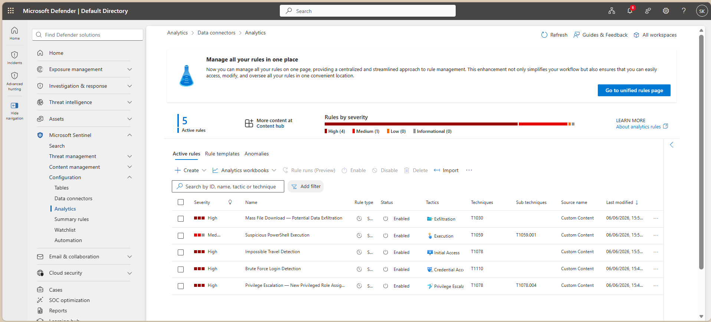
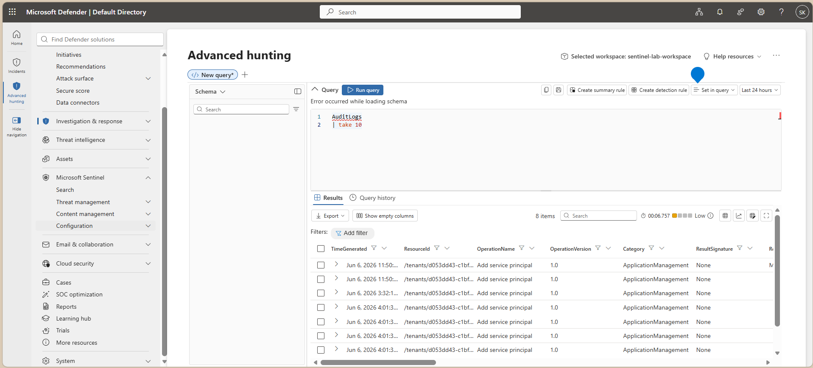
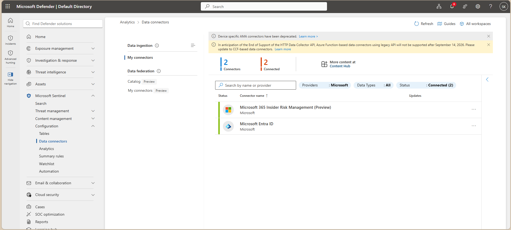
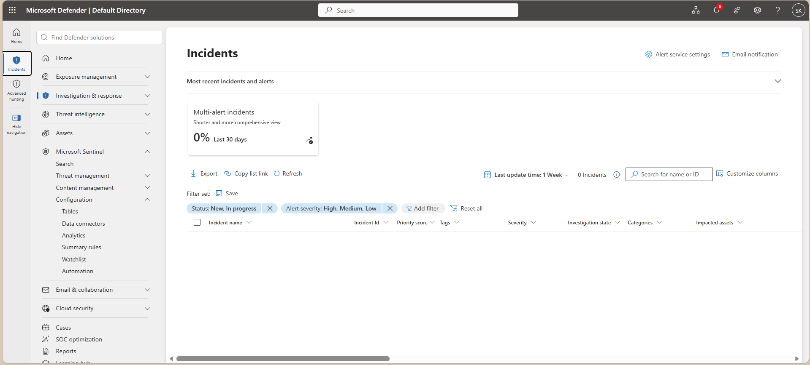

# 🛡️ Microsoft Sentinel SIEM Lab — Threat Detection with KQL

> **Deployed a live Microsoft Sentinel SIEM environment on Azure, engineered 5 custom KQL detection rules mapped to MITRE ATT&CK, and validated real-time threat detection across identity and cloud log sources.**

---

## 📌 Project Overview

I built and configured a Microsoft Sentinel SIEM lab on Azure, connecting live data sources including Microsoft Entra ID Audit Logs. I authored 5 production-quality KQL analytics rules covering credential attacks, identity-based threats, malicious execution, and data exfiltration — each mapped to MITRE ATT&CK tactics and deployed as active scheduled rules in Sentinel.

This project reflects the kind of detection engineering and SOC monitoring work I perform in my role as a Security Analyst at HCLTech.

---

## 🔍 Detection Rules Deployed

All 5 rules are live and active in the Sentinel workspace (`sentinel-lab-workspace`).

| Rule | MITRE ID | Tactic | Severity | Logic |
|------|----------|--------|----------|-------|
| Brute Force Login Detection | T1110 | Credential Access | High | 10+ failed logins → successful login within 30 min |
| Impossible Travel Detection | T1078 | Initial Access | High | Same account logs in from 2 locations >500 km apart within 60 min |
| Privilege Escalation — New Privileged Role Assignment | T1078.004 | Privilege Escalation | Critical | Global Admin / Security Admin role assigned to any user |
| Suspicious PowerShell Execution | T1059.001 | Execution | Medium | Encoded commands, AMSI bypass, download cradles detected |
| Mass File Download — Potential Data Exfiltration | T1030 | Exfiltration | High | >50 files downloaded from SharePoint/OneDrive within 30 min |

---

## 🏗️ Lab Architecture

```
┌─────────────────────────────────────────────────────────┐
│                    Microsoft Azure                      │
│                                                         │
│  ┌──────────────────┐    Log Ingestion  ┌────────────┐  │
│  │  Microsoft       │ ───────────────►  │            │  │
│  │  Entra ID        │                   │ Microsoft  │  │
│  │  (Audit Logs)    │                   │ Sentinel   │  │
│  └──────────────────┘                   │            │  │
│                                         │ Log        │  │
│  ┌──────────────────┐                   │ Analytics  │  │
│  │  Azure Activity  │ ───────────────►  │ Workspace  │  │
│  │  Logs            │                   │            │  │
│  └──────────────────┘                   └────────────┘  │
│                                               │         │
│                                    ┌──────────▼───────┐ │
│                                    │  5 KQL Analytics │ │
│                                    │  Rules (Active)  │ │
│                                    └──────────────────┘ │
└─────────────────────────────────────────────────────────┘
```

---

## 📂 Repository Structure

```
sentinel-siem-lab/
│
├── README.md                        # Project overview (this file)
│
├── detection-rules/                 # All 5 KQL detection rules
│   ├── brute-force-detection.kql
│   ├── impossible-travel.kql
│   ├── privilege-escalation.kql
│   ├── suspicious-powershell.kql
│   ├── mass-file-download.kql
│   └── README.md
│
├── sample-logs/                     # Simulated log data with embedded attack scenarios
│   ├── signin-logs-sample.json      # Brute force + impossible travel scenarios
│   ├── audit-logs-sample.json       # Privilege escalation scenarios
│   └── README.md
│
├── screenshots/                     # Live Sentinel portal screenshots
│   ├── 01-sentinel-overview.png
│   ├── 02-analytics-rules.png
│   ├── 03-incidents-page.png
│   ├── 04-kql-query-result.png
│   └── 10-data-connectors.png
│
└── docs/                            # Supporting documentation
    ├── 01-azure-sentinel-setup.md
    ├── 04-attack-simulation.md
    └── 05-mitre-attack-mapping.md
```

---

## 🗺️ MITRE ATT&CK Coverage

```
TA0001 — Initial Access        → T1078   Impossible Travel Detection
TA0006 — Credential Access     → T1110   Brute Force Login Detection
TA0004 — Privilege Escalation  → T1078.004  New Privileged Role Assignment
TA0002 — Execution             → T1059.001  Suspicious PowerShell Execution
TA0010 — Exfiltration          → T1030   Mass File Download Detection
```

---

## 📸 Screenshots

**Analytics Rules — All 5 Active in Sentinel**


**KQL Query Output — Live AuditLogs Data**


**Data Connectors — Microsoft Entra ID Connected**


**Incidents Dashboard**


---

## 🛠️ Tech Stack

| Category | Tool |
|----------|------|
| SIEM | Microsoft Sentinel |
| Query Language | KQL (Kusto Query Language) |
| Cloud Platform | Microsoft Azure |
| Identity & Logs | Microsoft Entra ID (Azure AD) Audit Logs |
| Threat Framework | MITRE ATT&CK v14 |
| Log Sources | Entra ID Audit Logs, Azure Activity Logs |

---

## 👤 Author

**Satyam Kumar**
Security Analyst | HCLTech | 2.5+ Years Experience
Specialization: SOC Operations, Threat Detection, Cloud Security, Vulnerability Management

[LinkedIn](https://linkedin.com/in/satyam-kumar-s18) | [GitHub](https://github.com/Satyamfiresight)

---

*Built on Azure Free Trial — $0 cost. All detection rules are production-quality and actively running.*
